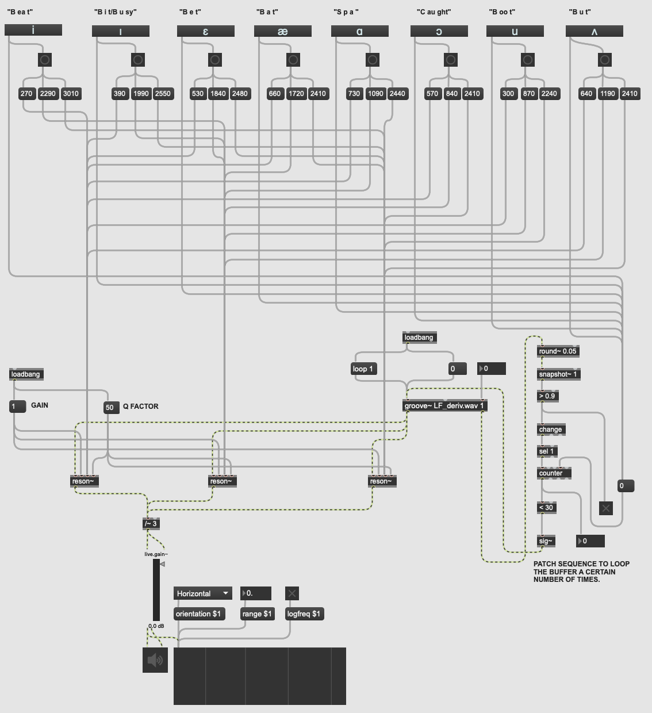

# Vowel Formant Synthesiser

Three resonant bandpass filters, in a parallel setup. The first three formant frequency values of eight vowel sounds are inputs into each of the filters.

The formant frequency values were informed by a [benchmark dataset](https://asa.scitation.org/doi/10.1121/1.1906875).

The [renowned](https://asa.scitation.org/doi/10.1121/10.0005879) [Liljencrants-Fant](http://www.glottopedia.org/index.php/Liljencrants-Fant_model) model serves as the source.

# IMPORTANT!
Make sure that `LF_deriv.wav` is in the same folder as the `.maxpat` file when running.

More information can be found within the patch itself.
